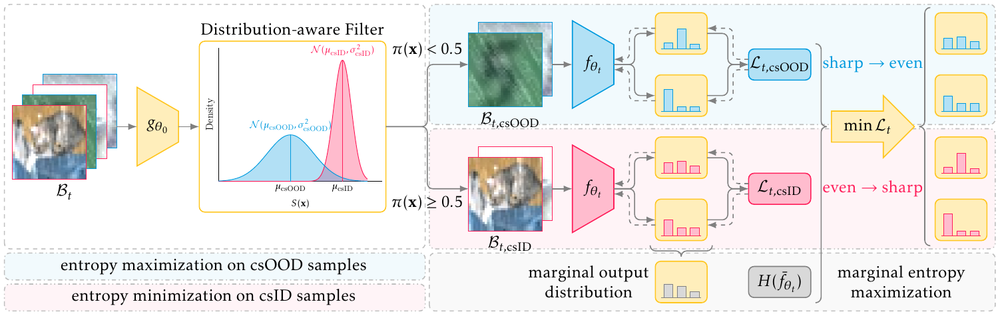

# Unified Entropy Optimization for Open-Set Test-Time Adaptation

This is a PyTorch implementation of our CVPR 2024 paper [Unified Entropy Optimization for Open-Set Test-Time Adaptation](https://arxiv.org/abs/2404.06065).



This repository also contains the implementation of [Towards Open-Set Test-Time Adaptation Utilizing the Wisdom of Crowds in Entropy Minimization](https://arxiv.org/abs/2308.06879).

## Prerequisites

```shell
conda create -n unient -y python=3.9
conda activate unient
pip install -r requirements.txt
```

## Experiments

### Datasets

#### CIFAR-10-C / SVHN-C

Download and extract [CIFAR-10-C](https://zenodo.org/records/2535967) manually or use the commands below:
```shell
wget --content-disposition https://zenodo.org/records/2535967/files/CIFAR-10-C.tar?download=1
tar -xvf CIFAR-10-C.tar
```

Download and extract [SVHN-C](https://drive.google.com/file/d/1IxX_2rtw0_RB4ewADEOB4icW7Idkje8P/view?usp=sharing) manually or use the commands below:
```shell
gdown 1IxX_2rtw0_RB4ewADEOB4icW7Idkje8P
tar -zxvf SVHN-C.tar.gz
```

Alternatively, following <https://github.com/hendrycks/robustness>, apply common corruptions and perturbations to [SVHN](http://ufldl.stanford.edu/housenumbers/) to produce SVHN-C.

Create symbolic links to the datasets:
```shell
mkdir cifar/data
ln -s /path/to/CIFAR-10-C cifar/data
ln -s /path/to/SVHN-C cifar/data
```

Moreover, for EATA, download [CIFAR-10](https://www.cs.toronto.edu/~kriz/cifar.html) and create a symbolic link:
```shell
ln -s /path/to/CIFAR-10 cifar/data
```

#### CIFAR-100-C / SVHN-C

Download and extract [CIFAR-100-C](https://zenodo.org/record/3555552) manually or use the commands below:
```shell
wget --content-disposition https://zenodo.org/records/3555552/files/CIFAR-100-C.tar?download=1
tar -xvf CIFAR-100-C.tar
```

Create a symbolic link to the dataset:
```shell
ln -s /path/to/CIFAR-100-C cifar/data
```

Moreover, for EATA, download [CIFAR-100](https://www.cs.toronto.edu/~kriz/cifar.html) and create a symbolic link:
```shell
ln -s /path/to/CIFAR-100 cifar/data
```

#### Tiny-ImageNet-C / ImageNet-O-64x64-C

Download and extract [Tiny-ImageNet-C](https://zenodo.org/records/2536630) manually or use the commands below:
```shell
wget --content-disposition https://zenodo.org/records/2536630/files/Tiny-ImageNet-C.tar?download=1
tar -xvf Tiny-ImageNet-C.tar
```

Download and extract [ImageNet-O-64x64-C](https://drive.google.com/file/d/1MdtUCbC5VknTgYne17YxC0jlSrfSdBkI/view?usp=sharing) manually or use the commands below:
```shell
gdown 1MdtUCbC5VknTgYne17YxC0jlSrfSdBkI
tar -zxvf ImageNet-O-64x64-C.tar.gz
```

Alternatively, following <https://github.com/hendrycks/robustness>, apply common corruptions and perturbations to [ImageNet-O](https://github.com/hendrycks/natural-adv-examples) to produce ImageNet-O-64x64-C.

Create symbolic links to the datasets:
```shell
mkdir tiny_imagenet/data
ln -s /path/to/Tiny-ImageNet-C tiny_imagenet/data
ln -s /path/to/ImageNet-O-64x64-C tiny_imagenet/data
```

Moreover, for EATA, download [Tiny-ImageNet](http://cs231n.stanford.edu/tiny-imagenet-200.zip) and create a symbolic link:
```shell
ln -s /path/to/Tiny-ImageNet tiny_imagenet/data
```

#### ImageNet-C / ImageNet-O-C

Download and extract [ImageNet-C](https://zenodo.org/records/2235448) manually or use the commands below:
```shell
bash imagenet/download.sh -p /path/to/ImageNet-C
```

Download and extract [ImageNet-O-C](https://drive.google.com/file/d/1In4tZQes8YkFN_NEyQmjxFh-YP3iwpE0/view?usp=sharing) manually or use the commands below:
```shell
gdown 1In4tZQes8YkFN_NEyQmjxFh-YP3iwpE0
tar -zxvf ImageNet-O-C.tar.gz
```

Alternatively, following <https://github.com/hendrycks/robustness>, apply common corruptions and perturbations to [ImageNet-O](https://github.com/hendrycks/natural-adv-examples) to produce ImageNet-O-C.

Create symbolic links to the datasets:
```shell
mkdir imagenet/data
ln -s /path/to/ImageNet-C imagenet/data
ln -s /path/to/ImageNet-O-C imagenet/data
```

Moreover, for EATA, download [ImageNet](https://www.image-net.org/) and create a symbolic link:
```shell
ln -s /path/to/ImageNet imagenet/data
```

For more details on the datasets, please refer to <https://github.com/hendrycks/robustness>.

### CIFAR-10 to CIFAR-10-C

```shell
cd cifar

# perform a hyperparameter grid search
bash run.sh -g 0 -d cifar10
```

### CIFAR-100 to CIFAR-100-C

```shell
cd cifar

# perform a hyperparameter grid search
bash run.sh -g 0 -d cifar100
```

### Tiny-ImageNet to Tiny-ImageNet-C

Train the model on the source dataset or use our pre-trained checkpoint from [here](https://drive.google.com/file/d/1rz4cuemKTsVxA26x9xTXKJMmHB8i3Hrp/view?usp=sharing).

```shell
cd tiny_imagenet

# optional
python train.py ./data/tiny-imagenet-200 -a resnet50 --epochs 50 --lr 0.01 --pretrained --gpu 0

# perform a hyperparameter grid search
bash run.sh -g 0
```

### ImageNet to ImageNet-C

```shell
cd imagenet

# perform a hyperparameter grid search
bash run.sh -g 0
```

## Citation

```
@article{gao2024unified,
  title={Unified Entropy Optimization for Open-Set Test-Time Adaptation},
  author={Zhengqing Gao and Xu-Yao Zhang and Cheng-Lin Liu},
  journal={arXiv preprint arXiv:2404.06065},
  year={2024}
}
```

## Acknowledgements

Our implementation references the codes in the following repositories:
- [Tent](https://github.com/DequanWang/tent)
- [CoTTA](https://github.com/qinenergy/cotta)
- [EATA](https://github.com/mr-eggplant/EATA)
